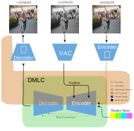

# Natural Video Colorization with Diffusion Models

This repository has the code used to perform Deep Learning Video Colorization (DLVC) using Denoising Diffusion Probabilistic Model (DDPM) performing denosing in the latent space. The frames are encodede by a encoder $\mathcal{E}$ pre-trained in the ImageNet dataset to convert the frame to pixel to latent space, this process are realized to decrease the size of samples, making the diffusion process more efficient in the training, the conversion from pixel space back to the pixel space are responsability of the pre-treianed decoder $\mathcal{D}$.

To guide the denosing process of the diffusion model, a pre-trained Visual transforms denoted Visual Attention Conditioning (VAC), where the grayscale $R$ frame are transformed into latent space denoted $\mathcal{V}_{features}$, to serve as reference to the DMLC (Diffusion Model Latent Colorization) that after performing the denoise $\mathcal{L}at_c$. In this way the result are a colorized version denoted $S_{c}$ of the input frame $R$.

## Archicteure
The implementation of the project is presented below, where the pre-trained coders and the data flow are described:



# Usage
The evaluation in this code is realized by ```video_colorization.py```, where necessary inform the dataroot with the grayscale video, and the result will be saved at the path: ```/video_output/colorized_video.mp4```

### Training
To train in your data is necessary realize some steps,the first is prepare the data in this structure

## Data Sctutre
```
└── root
    └── video.mp4
        ├── 00000.jpg
        ├── 00001.jpg
        └── 00002.jpg
    └── video1.mp4
        ├── 00000.jpg
        ├── 00001.jpg
        └── 00002.jpg
    └── video2.mp4
        ├── 00000.jpg
        ├── 00001.jpg
        └── 00002.jpg
```

## Latent Space
Second step is create the latent space of the video frames, this process are done by the ```feature_exctration.py```, after this a numpy file ```latent.npz``` containing all tensor will be created at the folder ```/data/DATASET_NAME/```. This process is necessary to generate the space that DMLC will create the version colorized of the $S_{g}$.

## Training diffusion
Third step is the training, this process as realied by the file ```train_diffusion.py```, where the the model realized the train. The topology of the network is avalible in ```modules.py```, where is possible change how layers are present. But, to change the deep of each layer is possible through the param *net_dimension*. The trained model will be saved at the folder ```unet_model```.